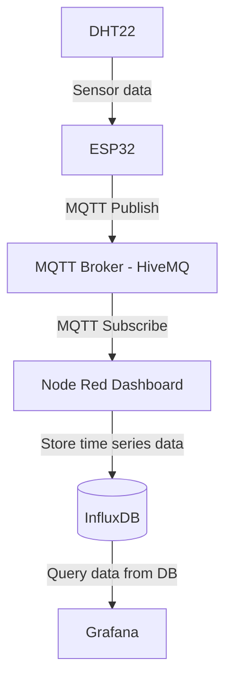

# Assignment: Internet of Things (IoT)

This project has been created as an assignment in the 1dv027 course at Linneaus University. A DHT22 sensor measures the humidity and temperature and publishes this data to an MQTT broker which the dashboard subscribes to. Instead of using real hardware, Wokwi online simulator has been used instead. The DHT22 sensor is connected to an ESP32 which is connected to a public broker and publishes the sensor data (humidity and temperature) to the topics `lnu/iot/fj222wh/humidity` & `lnu/iot/fj222wh/temperature`. Node-Red is used to visualise the data from the DHT22 sensor. It's monotoring the temperature and humidity by updating the incoming sensor data in real time while being able control the LED light from the dashboard. Grafana is used to display historical data and let the user analyse the data based on a chosen time range.

## Project Links
- **Live Dashboard URL:** [https://cu2058.camp.lnu.se/dashboard/](https://cu2058.camp.lnu.se/dashboard/)
- **Wokwi Simulation URL:** [https://wokwi.com/projects/463732153061923841](https://wokwi.com/projects/463732153061923841)
- **Backend Node Red** [https://cu2058.camp.lnu.se/nodered](https://cu2058.camp.lnu.se/nodered/)
- **Repository URL:** [https://github.com/fj222wh/iot-1dv027](https://github.com/fj222wh/iot-1dv027)


## Stack
The MING-stack has been used for this iot project.
|          |                                                                             |
|----------|-----------------------------------------------------------------------------|
| MQTT     | To publish and subscribe to topics                                          |
| InfluxDB | Time series database to store the data from the DHT22 sensor                |
| Node-Red | Visualise dashboard for monotoring and controlling the LED                  |
| Grafana  | To query and visualise the data from the database. Create dynamic diagrams. |


## MQTT Topics and Payloads

### Sensor Data (published by Wokwi)
- **Topic:** `lnu/iot/fj222wh/humidity` & `lnu/iot/fj222wh/temperature`
- **Payload (JSON):**

```json
{
  "temperature": 23.2
}
```
or 
```json
{
  "humidity": 56
}
```


### Device Commands (published by dashboard, subscribed by Wokwi)
- **Topic:** `lnu/iot/fj222wh/command/led`
- **Payload (JSON):**

```json
{
  "payload": "on"
}
```


## Architecture and Data Flow
1. The DHT22 sensor mesaures the humidity and temperature and the ESP32 reads the data.
2. The data is published to the public HiveMQ MQTT broker
3. Node Red subscribes to the MQTT broker and every time new data is published the Node Red dashboard is being updated in real time, showing the current temperature and humidity.
4. The data recieved from the broker is stored in the time series database InfluxDB.
5. Grafana has connected InfluxDB as a data source and queries data from the database for visualisation. Diagrams showing the historical data over humdiity and temperature are created with grafana and embedded into the Node Red dashboard.




## Reflection
**1. Which frontend technologies did you choose, and why?**
I chose to create the dashboard with Node Red since I wanted to learn a new technology. Since Node Red already has built in nodes for connecting to MQTT and InfluxDB was it quite convenient.

**2. How does handling real-time MQTT data over WebSockets differ from a standard REST API workflow?**
There is a significant difference between MQTT data compared to the standard REST API workflow. In the REST API workflow the client has frequently make requets to the server to pull data while with the MQTT the publisher can push data to the broker och all subscribers can get the information from that specific topic. This avoids unnecessary pulling since the client does not have to constantly ask the server for new data, instead with MQTT the data is being published and all subscribers will get the new data when something updates. This is better for real-time updates since it is faster and more efficient, and it helps prevent latency that can occur when making requests over HTTP.


**3. What was the most challenging integration step (hardware, broker, backend, database, frontend), and how did you solve it?**
The most challenging in this project was the understand how each part should communicate with the next part of the architecture. I solved it by trying to understand one unit at a time. In the beginning I struggled with understanding MQTT and the Wokwi simulation. 

